cap - hack the box

machine ip: 10.10.10.245

primeira coisa que faço, é um ping para ter certeza que tenho uma conexão bem sucedida:

$ ping 10.10.10.245

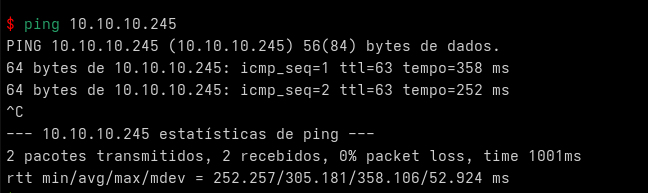

Após o ping, incio um processo de scan com o Nmap, para identificar possíveis vulnerabilidades e portas abertas:

$ nmap -sV -Pn 10.10.10.245

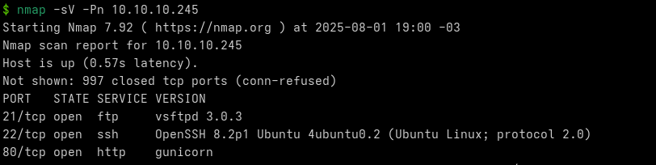

Sabemos que a porta FTP está aberta, então deve haver uma possível comunicação vulnerável.. Vamos dar uma olhada no site (porta 80, http)

Analisando a página, aparenta ser um dashboard que demonstra o monitoramento do servidor..

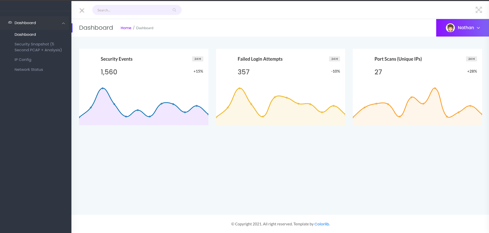

Na página "Security Snapshot" podemos fazer o download de um arquivo .pcap

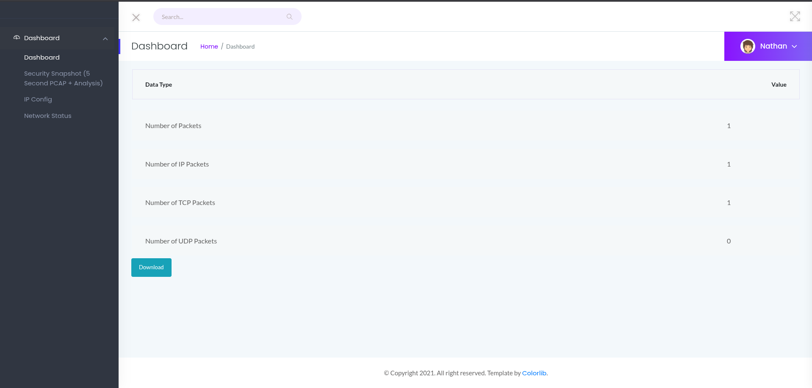

Abrindo o .pcap, percebemos que é um arquivo de captura de pacotes, que podemos examinar usando o Wireshark.

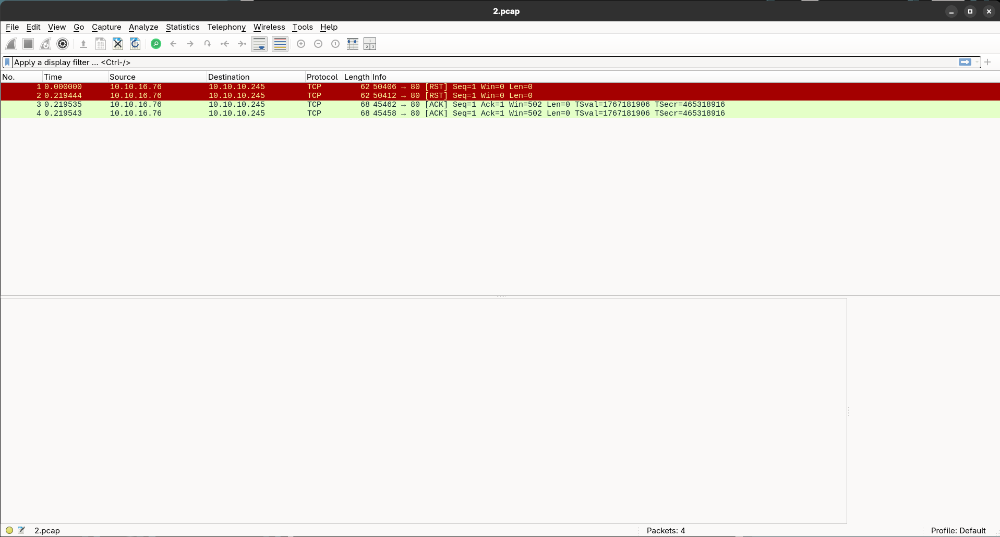

Na url da página "Security Snapshot", podemos analisar que existe um ID que pode ser alterado. Alterando o ID para 0, adquirimos a primeira snapshot capturada pelo servidor.

id = 2

id = 0 
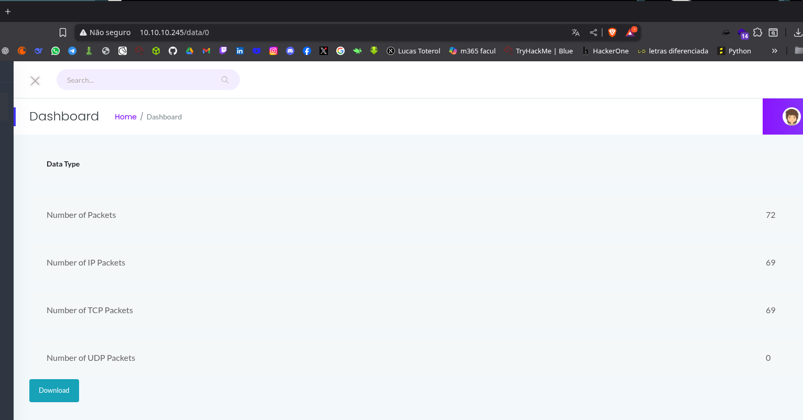

Assim conseguimos um arquivo completo para analise, o "0.pcap"

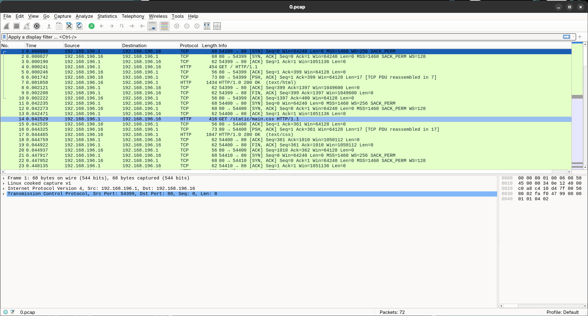

Ao pesquisar por "ftp" na barra de filtros do Wireshark, encontramos diversos pacotes classificados com ftp, o que os mesmos tem dados comprometedores:

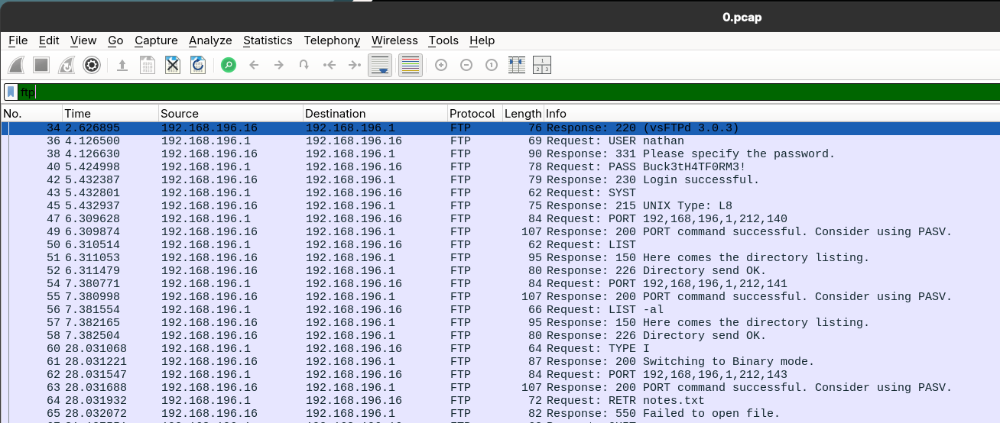

USER: nathan
PASS: Buck3tH4TF0RM3!

Podemos também analisar estes pacotes, podemos ver todas as requisições que o usuário nathan fez, desde sua primeira requisição ftp, até sua saída.

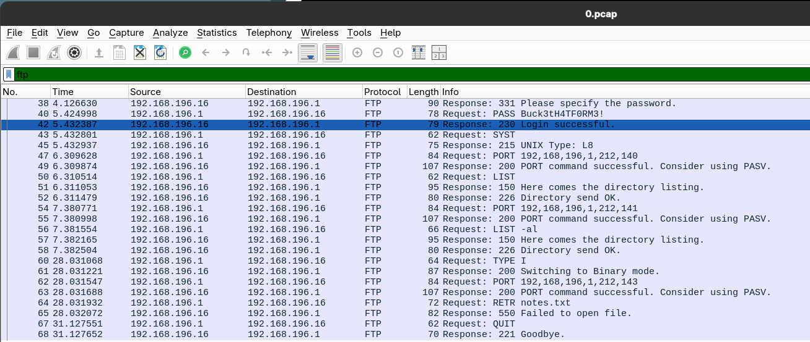

agora com  usuário e senha em mãos, podemos nos conectar via ssh ao alvo:

$ ssh nathan@10.10.10.245

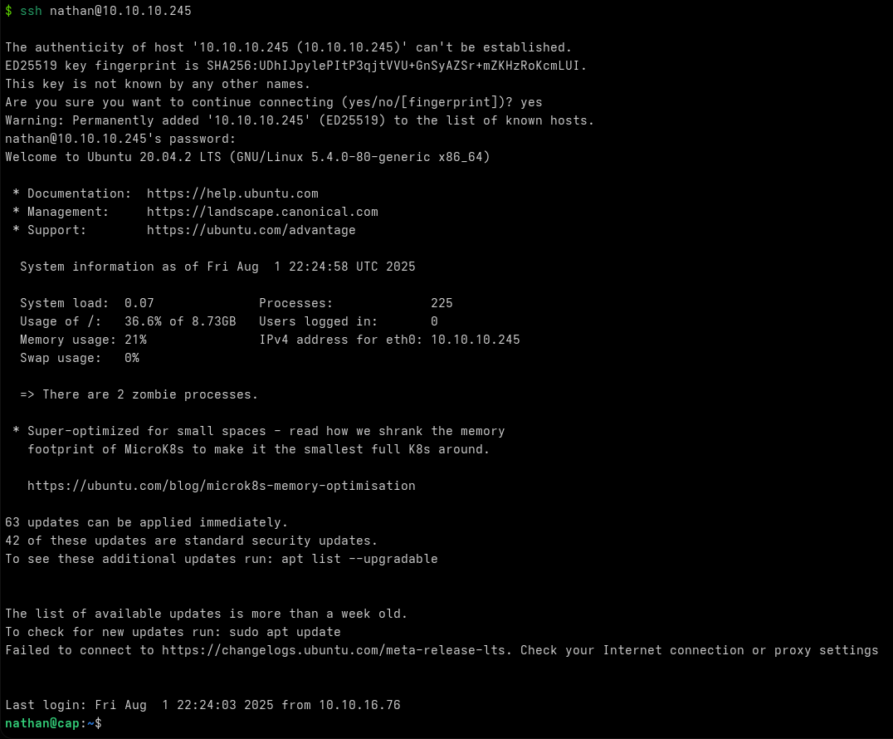

Após a conexão bem sucedida, conseguimos acesso a pasta do usuário "nathan", onde encontramos a nossa primeira key

nathan@cap:~$ cat user.txt 
830f68f226a095a23b0cc9bb531cd5f1

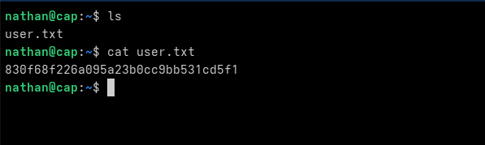

agora, para o escalonamento de privilégios, estaremos utilizando o getcap para identificar arquivos com capacidades espaciais de escalonamento:

nathan@cap:~$ getcap -r / 2>/dev/null
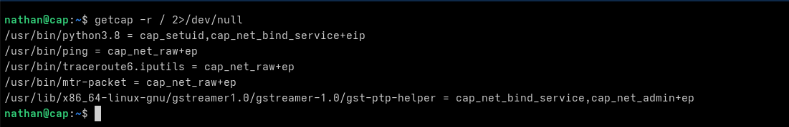

Para uma breve análise:
A maioria dos itens listados são para fins relacionados a rede e sniffing, netão neste caso, não nos será útil agora..
Mas o python 3.8 tem o "cap_setuid", ou seja, permite a mudança de UID (identidade de usuário), o que pode ser utilizado para executar comandos como root

nisso, podemos utilizar o python 3.8 para rodar um script simples, que da o acesso root para nós, o usuário comum:

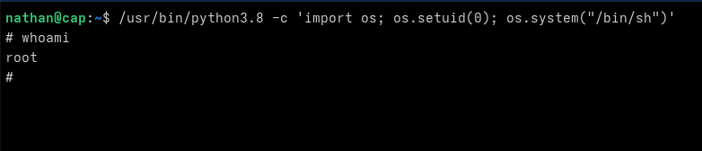

Com o acesso root, podemos finalmente pegar a ultima chave e dizer que a máquina esta conlcuida

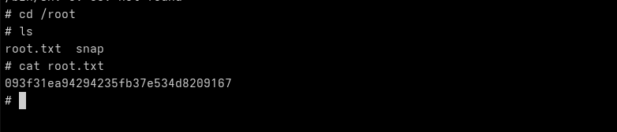
